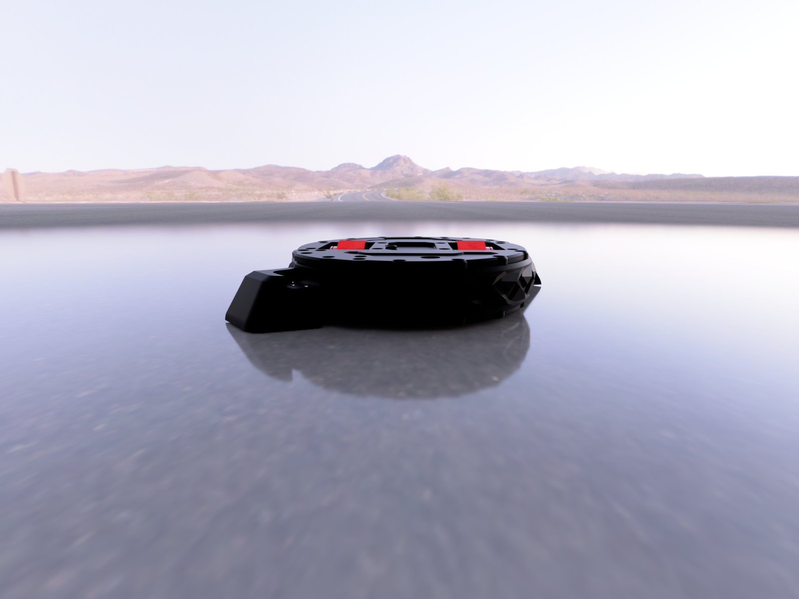

# Meltybrain 3lb Combat Robot



A 3lb meltybrain (translational drift / melty) combat robot. This repo contains CAD, manufacturing files, printing guides, build guides, and firmware guides.

**New to this? Start here: `build-guide/00-start-here.md`**

## Quick Tracker — copy this to a GitHub Issue to track your build

```markdown
- [ ] 1. Read build-guide/00-start-here.md
- [ ] 2. Order electronics (BOM.md)
- [ ] 3. Export + order PCBWay parts (manufacturing/pcbway/README.md)
- [ ] 4. Print plastic parts (3d-printing/README.md)
- [ ] 5. Mechanical assembly (build-guide/01-frame-assembly.md)
- [ ] 6. Electronics install (build-guide/02-electronics-setup.md)
- [ ] 7. Flash + configure firmware (firmware/README.md)
- [ ] 8. Spin test + trim (build-guide/03-testing-and-driving.md)
- [ ] 9. Weigh-in (must be <= 1360g) + combat ready
```

## Repo Map

| Folder / File | What it is |
|---|---|
| `Main CAD.step` | Full robot assembly (source of truth) |
| `Wheel Pod.step` | Drive pod sub-assembly |
| `Standard Weapon Teeth.step` / `Undercutter Config.step` | Weapon options |
| `manufacturing/pcbway/` | **Files to send to PCBWay for machining.** CNC + sheet-metal exports, how to order, checklist. |
| `manufacturing/materials-guide.md` | **Titanium vs aluminum vs steel verdict.** What to use where (steel ring, alu plates, TPU cradle, Ti cleats). |
| `manufacturing/P1-mass-audit.md` | **P1 weight audit (measured from YOUR STEPs).** Steel-vs-Ti branch table vs 1361g cap — read before ordering metal. |
| `BOM.md` | **Buying guide.** Everything to buy, with links to fill in, quantities, alternates. |
| `3d-printing/` | **Files to print yourself.** Which STLs to export, material, slicer settings. No pre-sliced G-code (slice for YOUR printer). |
| `build-guide/` | Beginner-friendly step-by-step build + setup. |
| `firmware/` | Firmware flashing, config, gyro setup, failsafe. |

## Current CAD Files (in root for now)

Do not send these whole assemblies directly to PCBWay. Export individual parts first — see `manufacturing/pcbway/README.md`.

- `Main CAD.step` — 17.7 MB full assembly
- `Wheel Pod.step` — drive module
- `Standard Weapon Teeth.step`, `Undercutter Config.step` — weapon variants

> TODO for maintainer: split exports into `manufacturing/pcbway/cnc/*.step` and `manufacturing/pcbway/sheet-metal/*.dxf`, and `3d-printing/stl/*.stl` so builders don't have to dig through assemblies.
