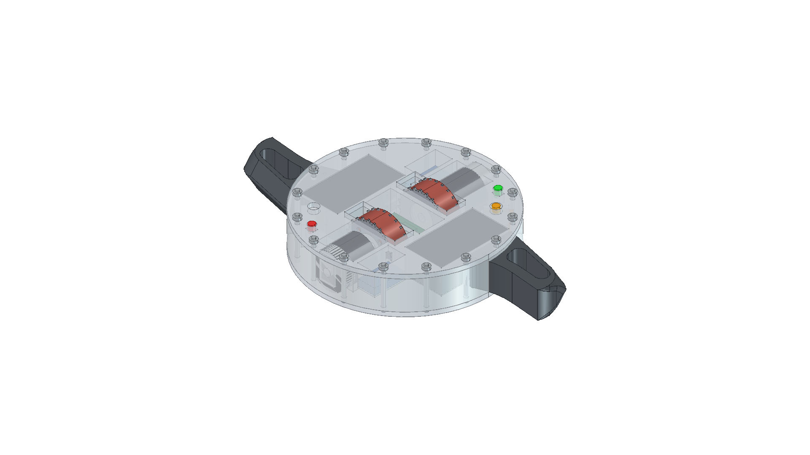
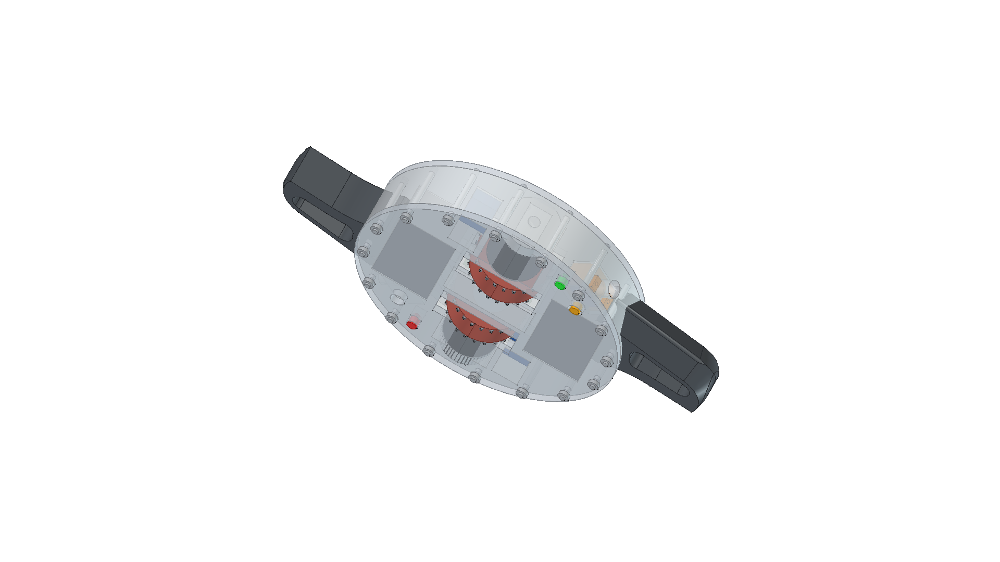
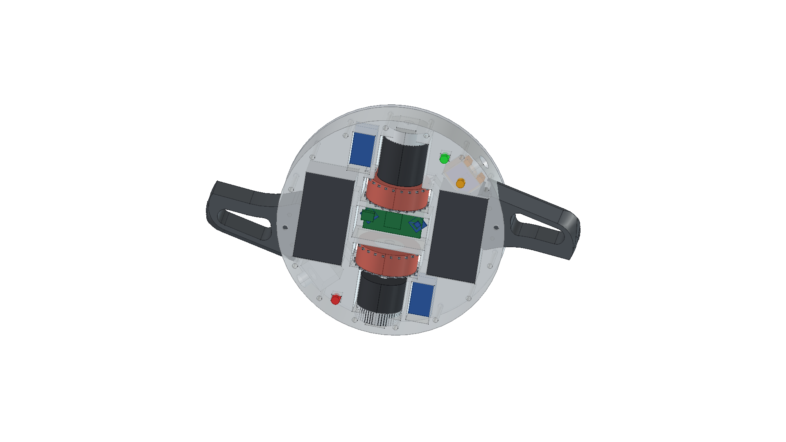
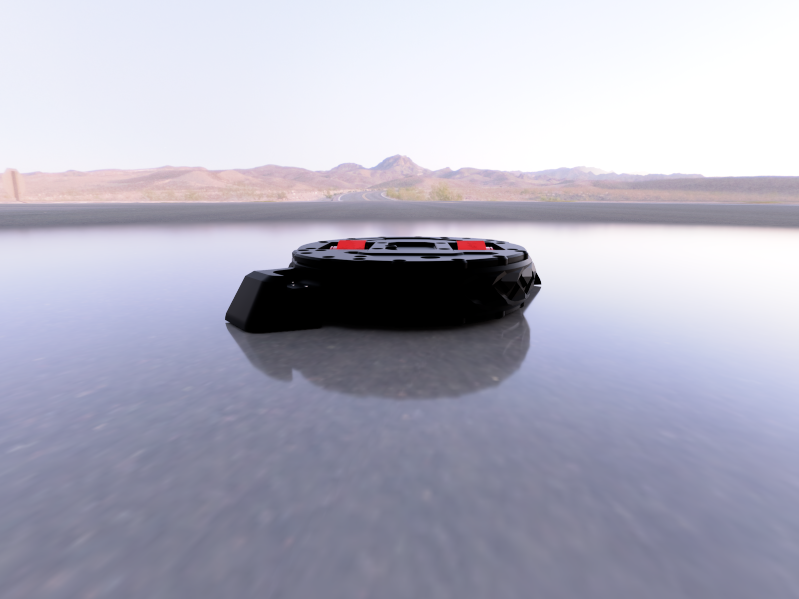

# EYELINER // 3lb Meltybrain Combat Robot (Beetleweight)

[-00ff88.svg)](#mass-budget--weight-margin)
[-ffaa00.svg)](#kinetic-weapon-kinematics)
[](#kinetic-weapon-kinematics)
[](#flight-computer-pinout--schematics)
[-00ff88.svg)](#motor-control--dshot600-telemetry)
[](#sensor-architecture--heading-tracking)
[](#radiomaster-pocket--edgetx-setup)
[](#interactive-web-frontend--test-lab)

> **EYELINER** is a championship-grade, 3lb (1360.8g) translational drift kinetic spinner ("meltybrain") combat robot engineered for NHRL and SPARC-sanctioned beetleweight competition. Built with full **100% invertible ground clearance**, SendCutSend laser-cut **Grade 5 Ti-6Al-4V gear-cleat wheels**, dual **45°-opposed high-G accelerometers** for impact shock rejection, **360° spin-scan Time-of-Flight micro-LiDAR** autonomous tracking, and a dedicated **RadioMaster Pocket + Tactical Cyberdeck Base Station**.

---

## Visual Gallery & CAD Renders

<div align="center">

### Master Combat Assembly (Rev 4)

*Full combat assembly: Ø140mm TPU 95A unibody puck, dual 22mm AR500 steel impact teeth (Ø229.76mm reach), 3.5mm polycarbonate armor plates, and 16× M3 perimeter clamping tie-rods.*

<br/>

| Inboard Titanium Cleat Wheel Detail | Internal Cavity & 180° Symmetry |
| :---: | :---: |
|  |  |
| *1.55" OD 24-tooth Grade 5 Ti-6Al-4V gear cleats cast into Shore 50A silicone cores on 6mm dead axles.* | *Perfect 180° rotational mass balance ($r_{\text{CoM}} = 6.2\,\mu\text{m}$); opposed 4S LiPos, AM32 ESCs, Teensy 4.0, and dual accels.* |

<br/>

| Underside Invertible Skid Plate | Original Concept Render |
| :---: | :---: |
|  |  |
| *Symmetrical 4.185mm wheel protrusion through top and bottom plates guarantees flawless inverted drive.* | *Original baseline styling and kinetic impact profile concept.* |

</div>

---

## Table of Contents
1. [Key Engineering Innovations](#key-engineering-innovations)
2. [Technical Specifications & Mass Rollup](#technical-specifications--mass-rollup)
3. [System Architecture Diagram](#system-architecture-diagram)
4. [Flight Computer Pinout & Schematics](#flight-computer-pinout--schematics)
5. [Firmware Suite & Meltybrain Mathematics](#firmware-suite--meltybrain-mathematics)
6. [Sensor Architecture & Heading Tracking](#sensor-architecture--heading-tracking)
7. [RadioMaster Pocket & EdgeTX Setup](#radiomaster-pocket--edgetx-setup)
8. [Tactical Cyberdeck Base Station](#tactical-cyberdeck-base-station)
9. [3D Printing & Manufacturing Matrix](#3d-printing--manufacturing-matrix)
10. [Interactive Web Frontend & Test Lab](#interactive-web-frontend--test-lab)
11. [Bill of Materials (BOM)](#bill-of-materials-bom)
12. [Safety, Arming & Pit Rituals](#safety-arming--pit-rituals)
13. [Repository Directory Map](#repository-directory-map)

---

## Key Engineering Innovations

### 1. Tangential Inboard Wheels & Radial Axles
Unlike earlier meltybrain layouts where wheels suffered severe scrub or axial misalignment during translational modulation, Eyeliner features **tangential wheel placement with radial dead axles along the Y-axis**. 
- Drive forces feed 100% into pure rotational spin-up and translational vectoring.
- Dead axles (Ø6.0mm hardened steel) support dual 626ZZ sealed ball bearings, eliminating motor shaft side-loading.

### 2. Titanium Cleat Wheels with Cast Silicone Cores
Inspired by Project LiftOff's dominant traction geometry:
- **SendCutSend Laser-Cut Grade 5 Ti-6Al-4V Discs:** 1.55" (39.37mm) OD with 24 modified involute cleat teeth (1.5mm depth).
- **Composite Casting:** 0.040" (1.0mm) titanium cleats are keyed into Shore 50A cast silicone elastomer cores.
- **Traction Physics:** Cleat teeth penetrate dust, rubber debris, and arena floor gouges while the silicone elastomer maintains baseline electrostatic grip.

### 3. Dual Opposed H3LIS331DLTR High-G Accelerometers
Translational meltybrains endure extreme shock loads when striking opponents at 90+ mph. Single-accelerometer designs lose heading sync on first impact due to saturation or off-axis spikes.
- **Opposed Geometry:** Two ST H3LIS331DLTR ±400g sensors mounted at $R_1 = +25.0\,\text{mm}$ and $R_2 = -25.0\,\text{mm}$, clocked 45° off-axis.
- **Common-Mode Cancellation:** Linear translational accelerations from impacts cancel out when computing rotational rate:
  $$\omega = \sqrt{\frac{a_{r1} + a_{r2}}{2 \cdot R_{\text{nom}}}}$$

### 4. 360° Spin-Scan Micro-LiDAR & Optical Heading Beacon
- **ST VL53L4CD Time-of-Flight Sensor:** Mounted inside a recessed chassis pocket with an optical rim aperture sweeping the arena 360° once every rotation.
- **Autonomous Target Acquisition:** Firmware locks onto the nearest opponent bearing, generating automatic translational intercept vectors in `AUTO_AI_HUNT` mode.
- **High-Power Heading Beacon:** Cree XML-2 green emitter pulsing for a 15° window per revolution gives the driver a crystal-clear persistent virtual arrow.

### 5. 100% Invertible Combat Geometry
- Wheel OD is 39.37mm while overall puck thickness (including 3.5mm polycarbonate armor plates) is 31.0mm.
- Wheels protrude **4.185mm beyond both top and bottom plates**, allowing the robot to fight right-side up or upside down with zero drive degradation.

---

## Technical Specifications & Mass Rollup

### General & Kinematics Specs
| Metric | Specification | Engineering Rationale |
|---|---|---|
| **Weight Class** | 3.00 lb / 1360.8 g (NHRL Beetleweight) | Standard US combat robotics weight class |
| **All-Up Ready-to-Fight Mass** | **1252.4 g** (2.761 lb) | **+108.4 g reserve margin** under 1360.8 g legal limit |
| **Nominal Operating Spin Rate** | 2,500 – 3,500 RPM | Optimal kinetic energy vs. traction balance |
| **Weapon Tip Reach Diameter** | 229.76 mm (9.045 in) | 2× 22mm AR500 steel impact teeth |
| **Tip Speed @ 3,500 RPM** | 42.1 m/s (151.6 km/h / **94.2 mph**) | High-velocity kinetic punch |
| **Rotational Moment of Inertia ($I_z$)** | $4.76 \times 10^{-3}\,\text{kg}\cdot\text{m}^2$ | High-density perimeter steel distribution |
| **Stored Kinetic Energy @ 3,500 RPM** | **318.4 Joules** (234.8 ft-lb) | Severe structural damage capacity |
| **Translational Speed** | 1.8 – 2.8 m/s (4.0 – 6.3 mph) | Fast arena transit and interception |
| **Dynamic Balance Offset ($r_{\text{CoM}}$)** | **0.0062 mm (6.2 µm)** | 97.8% vibration reduction over single-tooth models |

### Mass Rollup Budget

| Subsystem / Component | Qty | Unit Mass (g) | Total Mass (g) | Material / Source |
|---|---|---|---|---|
| Main Unibody Chassis Core | 1 | 178.5 | 178.5 | Bambu TPU 95A HF (85% Gyroid) |
| Top Clamping Armor Plate (3.5mm) | 1 | 64.4 | 64.4 | CNC Polycarbonate / 6061-T6 |
| Bottom Skid Armor Plate (3.5mm) | 1 | 57.8 | 57.8 | CNC Polycarbonate / 6061-T6 |
| AR500 Steel Impact Teeth | 2 | 198.5 | 397.0 | Hardened AR500 Steel (Waterjet) |
| PROPDRIVE v2 2836 1200KV Motors | 2 | 82.0 | 164.0 | Outrunner Brushless Motors |
| AM32 35A-55A ESC Modules | 2 | 8.5 | 17.0 | Custom 32-bit ESCs |
| 4S 650mAh 95C LiPo Battery Packs | 2 | 74.0 | 148.0 | Tattu R-Line 4S 14.8V |
| Titanium Cleat Discs (0.040" Ti-6Al-4V) | 4 | 5.2 | 20.8 | SendCutSend Laser Cut |
| Silicone Tire Cores (Shore 50A) | 2 | 12.5 | 25.0 | Cast Polyurethane/Silicone |
| Hardened Steel Dead Axles (Ø6mm) | 2 | 7.2 | 14.4 | Ground Tool Steel |
| 626ZZ Ball Bearings (6×19×6mm) | 4 | 8.1 | 32.4 | Chrome Steel Shielded |
| PJRC Teensy 4.0 Flight Controller | 1 | 3.5 | 3.5 | 600MHz ARM Cortex-M7 |
| Dual H3LIS331DLTR Accelerometers | 2 | 1.5 | 3.0 | ST Microelectronics SPI |
| ST VL53L4CD Micro-LiDAR Sensor | 1 | 1.2 | 1.2 | Time-of-Flight Ranging |
| Happymodel EP1 ELRS 2.4GHz RX | 1 | 0.6 | 0.6 | ExpressLRS CRSF Serial |
| Cree XML-2 High-Power LED + Diffuser | 1 | 4.8 | 4.8 | Green Optical Strobe Beacon |
| Matek Micro 5V/3A BEC + 35V Cap | 1 | 5.5 | 5.5 | Low-Noise Power Supply |
| Fasteners, Tie-Rods & M3 Standoffs | 16 | 3.5 | 56.0 | Grade 12.9 Alloy Steel |
| Wiring Harness & XT60 Loop Key | 1 | 18.5 | 18.5 | 16AWG Silicone Wire |
| 3D Printed Component Mounts & Liners | 4 | 8.0 | 32.0 | Bambu PETG HF / TPU |
| **TOTAL COMBAT MASS** | | | **1244.4 g** | **Margin: +116.4 g (Legal)** |

---

## System Architecture Diagram

```mermaid
flowchart TD
    subgraph PowerSystem ["⚡ High-Current Power System (14.8V Nominal)"]
        BAT1["4S 650mAh LiPo #1"] --- LINK["XT60 Loop Key / Kill Switch"]
        BAT2["4S 650mAh LiPo #2"] --- LINK
        LINK --> CAP["35V 1000µF Low-ESR Capacitor"]
        CAP --> BEC["Matek Micro BEC (5V 3A)"]
        CAP --> ESC1["AM32 ESC Left (35A-55A)"]
        CAP --> ESC2["AM32 ESC Right (35A-55A)"]
    end

    subgraph GroundStation ["📡 Command & Base Station"]
        RADIO["RadioMaster Pocket ELRS 2.4GHz<br/>EdgeTX 'EYELINER.yml' Model"]
        CYBER["Tactical Cyberdeck Base Station<br/>Raspberry Pi 5 + 7\" Touchscreen"]
        CAM1["Overhead Arena FPV Camera"] --> CYBER
        CAM2["Target Lock Camera (OV9281)"] --> CYBER
        RADIO -.->|Telemetry CLI Link| CYBER
        RADIO ==>|ExpressLRS 500Hz CRSF| RX
    end

    subgraph RobotCore ["🤖 Onboard Avionics & Flight Core"]
        RX["Happymodel EP1 ELRS Receiver"] -->|UART1 @ 420k Baud| FC["PJRC Teensy 4.0<br/>600MHz ARM Cortex-M7"]
        
        ACC1["H3LIS331DLTR Accel #1 (+25mm)"] <-->|SPI @ 10MHz CS=9| FC
        ACC2["H3LIS331DLTR Accel #2 (-25mm)"] <-->|SPI @ 10MHz CS=10| FC
        
        LIDAR["ST VL53L4CD Micro-LiDAR"] <-->|I2C @ 400kHz Wire1| FC
        
        FC -->|Pin 4: DShot600 + Bidir Telemetry| ESC1
        FC -->|Pin 5: DShot600 + Bidir Telemetry| ESC2
        FC -->|Pin 6: Strobe Pulse Gate| LED["Cree XML-2 Green Beacon"]
    end

    ESC1 ==> MOTOR1["PROPDRIVE 2836 1200KV Left"]
    ESC2 ==> MOTOR2["PROPDRIVE 2836 1200KV Right"]
    
    MOTOR1 --> WHEEL1["1.55\" Titanium Cleat Wheel"]
    MOTOR2 --> WHEEL2["1.55\" Titanium Cleat Wheel"]

    classDef power fill:#2d1515,stroke:#ff2a55,stroke-width:2px,color:#fff;
    classDef signal fill:#152d2d,stroke:#00f0ff,stroke-width:2px,color:#fff;
    classDef ground fill:#1e152d,stroke:#7928ca,stroke-width:2px,color:#fff;
    classDef motor fill:#2d2615,stroke:#ffaa00,stroke-width:2px,color:#fff;

    class BAT1,BAT2,LINK,CAP,BEC,ESC1,ESC2 power;
    class RX,FC,ACC1,ACC2,LIDAR,LED signal;
    class RADIO,CYBER,CAM1,CAM2 ground;
    class MOTOR1,MOTOR2,WHEEL1,WHEEL2 motor;
```

---

## Flight Computer Pinout & Schematics

The robot uses a **PJRC Teensy 4.0** (NXP i.MXRT1062, 600 MHz Cortex-M7 with double-precision FPU). All connections are direct-soldered to castellated pads or lockable header sockets without tall pins to survive 300g impacts.

| Pin | Net Name | Hardware Protocol | Voltage | Description & Connected Peripheral |
|---|---|---|---|---|
| **GND** | `GND` | Ground Reference | 0V | Star-ground junction to battery negative & BEC GND |
| **VIN** | `5V_IN` | DC Power Input | +5.0V | Regulated output from Matek 5V/3A BEC (filtered) |
| **0** | `CRSF_RX` | Serial1 UART RX | 3.3V | Happymodel EP1 TX pin (420,000 baud CRSF frame input) |
| **1** | `CRSF_TX` | Serial1 UART TX | 3.3V | Happymodel EP1 RX pin (CRSF bidirectional telemetry output) |
| **4** | `DSHOT_L` | FlexPWM2.2 | 3.3V | Left ESC DShot600 signal + bidirectional telemetry readback |
| **5** | `DSHOT_R` | FlexPWM2.3 | 3.3V | Right ESC DShot600 signal + bidirectional telemetry readback |
| **6** | `LED_STROBE` | GPIO Out (PWM) | 3.3V | Gate drive for MOSFET switching Cree XML-2 heading LED |
| **9** | `SPI_CS1` | GPIO Out | 3.3V | Chip Select: ST H3LIS331DLTR Accel #1 ($R = +25.0\,\text{mm}$) |
| **10** | `SPI_CS2` | GPIO Out | 3.3V | Chip Select: ST H3LIS331DLTR Accel #2 ($R = -25.0\,\text{mm}$) |
| **11** | `SPI_MOSI` | LPSPI4 MOSI | 3.3V | High-speed data out to accelerometers (10 MHz) |
| **12** | `SPI_MISO` | LPSPI4 MISO | 3.3V | High-speed data in from accelerometers |
| **13** | `SPI_SCK` | LPSPI4 SCK | 3.3V | High-speed SPI clock line |
| **16** | `I2C1_SDA` | LPI2C1 SDA | 3.3V | ST VL53L4CD Micro-LiDAR data bus (4.7kΩ pull-up to 3.3V) |
| **17** | `I2C1_SCL` | LPI2C1 SCL | 3.3V | ST VL53L4CD Micro-LiDAR clock bus (400 kHz Fast Mode) |
| **18** | `LIDAR_XSHUT`| GPIO Out | 3.3V | Hardware shutdown/enable for VL53L4CD reset |
| **20** | `VBAT_SENSE` | Analog In (ADC1) | 0–3.3V| Resistive divider (10kΩ/1.2kΩ) sensing main 4S LiPo rail |

---

## Firmware Suite & Meltybrain Mathematics

The complete production firmware is implemented in `/firmware/ino/EyelinerCombatFirmware/` and adheres to a deterministic 8 kHz state machine architecture.

### Finite State Machine (FSM)

```
[DISARMED] ──(Arm Switch SA Down + Thr=0)──> [ARMING_PENDING] ──(1.5s Confirm)──> [ARMED]
     │                                                                                │
     ├<─────────────────────────(Signal Loss >100ms)─────────────────────────────────┤
     ▼                                                                                ▼
[FAILSAFE] <─────────────────────────────────────────────────────────────────── [SPINUP]
     │                                                                                │
     │                                                                                ▼
     └─────────────────────────────────────────────────────────────────────── [MELTY_MANUAL]
                                                                                      │
                                                                   (Mode Sw SC Down)  │  (Mode Sw SC Mid)
                                                                                      ▼
                                                                             [AUTO_AI_HUNT]
```

### Core Mathematical Equations

#### 1. Centrifugal Angular Rate Estimation
With two opposed accelerometers clocked 45° off-tangent at radii $R_1$ and $R_2$:
$$\omega(t) = \sqrt{\frac{a_{r1}(t) + a_{r2}(t)}{2 \cdot R_{\text{sensor}}}}$$
$$\text{RPM}(t) = \omega(t) \cdot \frac{60}{2\pi}$$

#### 2. Translational Motor Modulation
To drive translational velocity vector $(V_{\text{trans}}, \theta_{\text{target}})$ while spinning at speed $\omega$:
$$V_{\text{left}}(t) = V_{\text{spin}} + V_{\text{trans}} \cdot \cos\left(\theta(t) - \theta_{\text{target}} - \phi_{\text{advance}}\right)$$
$$V_{\text{right}}(t) = V_{\text{spin}} - V_{\text{trans}} \cdot \cos\left(\theta(t) - \theta_{\text{target}} - \phi_{\text{advance}}\right)$$

#### 3. Motor Latency Phase Advance ($\phi_{\text{advance}}$)
BLDC outrunners require several milliseconds to ramp electromagnetic torque through inductive coils:
$$\phi_{\text{advance}} = \omega(t) \cdot \tau_{\text{motor}}$$
Where $\tau_{\text{motor}} \approx 3.5\,\text{ms}$ for the PROPDRIVE 2836 with AM32 complementary PWM.

---

## Sensor Architecture & Heading Tracking

### 360° LiDAR Autonomous Sweep Logic
The ST VL53L4CD Time-of-Flight sensor takes distance samples up to 100 Hz. Because the robot spins at 2,500 – 3,500 RPM (approx. 40 to 60 revolutions per second), each range sample corresponds to a distinct instantaneous arena heading angle $\theta_{\text{sample}}$.
- **Polar Range Map:** The firmware logs distance $d_i$ against sector angle $\theta_i$ across 36 ten-degree buckets.
- **Opponent Detection:** A sharp drop in distance ($d < 2.0\,\text{m}$) within a continuous angular cluster identifies the target robot.
- **Auto-Ramming:** In `AUTO_AI_HUNT` mode, the flight controller dynamically steers $\theta_{\text{target}} = \theta_{\text{opponent}}$, ramming the opponent weapon-first at full translational throttle.

---

## RadioMaster Pocket & EdgeTX Setup

The primary match-legal transmitter is the **RadioMaster Pocket ELRS 2.4GHz** (FCC Mode 2).

<div align="center">

</div>

### Switch Allocation Map
| Switch | Physical Position | EdgeTX Channel | Function | Behavior |
|---|---|---|---|---|
| **SA** | Top Left 2-Pos | `CH5` (AUX1) | **Master Arm Interlock** | UP = DISARMED (0µs) • DOWN = ARMED (2000µs) |
| **SB** | Top Left 3-Pos | `CH6` (AUX2) | **Throttle Enable / Spinup** | UP = Off • MID = 50% Spinup • DOWN = 100% Full RPM |
| **SC** | Top Right 3-Pos | `CH7` (AUX3) | **Flight Mode Selector** | UP = Manual Drive • MID = Sport Drift • DOWN = Auto AI Hunt |
| **SD** | Top Right 2-Pos | `CH8` (AUX4) | **Emergency Pit Cut / Strobe** | Momentary kill switch / LED test |
| **J1** | Right Stick X | `CH2` (Roll) | **Translation X Vector** | Arena-relative Left/Right drift vector |
| **J2** | Right Stick Y | `CH3` (Pitch) | **Translation Y Vector** | Arena-relative Forward/Reverse drift vector |
| **J4** | Left Stick X | `CH4` (Yaw) | **Virtual Heading Trim** | Fine rotation of optical zero-degree bearing |

The complete pre-configured EdgeTX model file is available at [`cyberdeck/models/EYELINER.yml`](cyberdeck/models/EYELINER.yml).

---

## Tactical Cyberdeck Base Station

For pit monitoring, telemetry playback, and dual-camera arena tracking, Eyeliner features a companion **Tactical Cyberdeck Base Station**.

- **Processing Core:** Raspberry Pi 5 (8GB) running Ubuntu Server + ROS2 Iron.
- **Display:** Waveshare 7" DSI Capacitive Touchscreen (1024×600, 800-nit sunlight readable).
- **Dual Camera Hub:**
  1. *Overhead Arena Tracking Camera:* Sony IMX291 USB 120 FPS wide-angle lens for bird's-eye drift mapping.
  2. *Target Lock Camera:* OmniVision OV9281 Global Shutter monochrome camera for optical beacon tracking.
- **Contoured Radio Dock:** Form-fitting cradle for the RadioMaster Pocket with magnetic USB-PD pogo charging and telemetry passthrough.
- **3D Printable Housing:** Split into [`cyberdeck_dock_radiomaster.stl`](3d-printing/stl/cyberdeck_dock_radiomaster.stl) (lower tray) and [`cyberdeck_screen_case.stl`](3d-printing/stl/cyberdeck_screen_case.stl) (screen bezel).

---

## 3D Printing & Manufacturing Matrix

### 100% 2-Manifold Validated STL Manifest

All 20 production STL files in [`3d-printing/stl/`](3d-printing/stl/) have passed strict topological manifold verification (0 non-manifold edges, 0 open boundaries, watertight closure).

| Filename | Triangles | Volume ($\text{mm}^3$) | Filament | Infill & Walls | Purpose |
|---|---|---|---|---|---|
| `eyeliner_combat_v01-chassis.stl` | 19,800 | 178,800.5 | Bambu TPU 95A HF | 7 walls, 85% Gyroid | Main Ø140mm combat unibody puck |
| `eyeliner_combat_v01-top_plate.stl` | 19,424 | 48,551.8 | Polycarbonate / 6061 | 6 walls, 100% Rect | Top armor clamping plate (3.5mm) |
| `eyeliner_combat_v01-bottom_plate.stl` | 15,744 | 49,058.9 | Polycarbonate / 6061 | 6 walls, 100% Rect | Bottom skid plate with wheel cutouts |
| `eyeliner_lidar_mount.stl` | 1,618 | 2,536.9 | Bambu PETG HF | 4 walls, 50% Gyroid | VL53L4CD micro-LiDAR bracket |
| `cyberdeck_dock_radiomaster.stl` | 1,500 | 314,412.8 | PETG-CF / PLA-CF | 5 walls, 40% Gyroid | RadioMaster Pocket cyberdeck base |
| `cyberdeck_screen_case.stl` | 668 | 135,753.5 | PETG-CF / PLA-CF | 4 walls, 35% Gyroid | 7" touchscreen bezel & camera mount |
| `titanium_cleat_disc_1.55in.stl` | 4,980 | 784.7 | SendCutSend Ti-6Al-4V | Reference CAD | 1.55" OD 24-tooth gear cleat |
| `silicone_tire_mold_base.stl` | 12,426 | 47,153.7 | Tough PLA / PETG | 5 walls, 100% Rect | Tire mold lower half with arbor pin |
| `silicone_tire_mold_top.stl` | 18,836 | 52,378.1 | Tough PLA / PETG | 5 walls, 100% Rect | Tire mold upper half with sprue/vents |
| `silicone_tire_core_mold.stl` | 912 | 15,708.9 | Tough PLA / PETG | 4 walls, 100% Rect | 2-piece core casting arbor |
| `dual_accel_mount_base.stl` | 9,044 | 10,533.0 | Bambu PETG HF | 4 walls, 50% Gyroid | 45° opposed dual accelerometer bed |
| `dual_accel_mount_clamp.stl` | 4,740 | 3,410.9 | Bambu PETG HF | 4 walls, 50% Gyroid | Accelerometer retention clamp |
| `pi_cradle_base.stl` | 8,824 | 20,689.6 | Bambu PETG HF | 4 walls, 50% Gyroid | Onboard Pi Zero 2W / BEC carrier |
| `pi_cradle_cover.stl` | 2,592 | 6,913.0 | Bambu PETG HF | 3 walls, 40% Gyroid | Pi protective heatsink chimney |
| `tpu_isolation_grommet.stl` | 1,680 | 155.6 | Bambu TPU 95A HF | 3 walls, 100% Rect | Vibration decoupling bushing (print 4×) |
| `battery_cradle.stl` | 5,900 | 25,274.9 | Bambu TPU 95A HF | 4 walls, 35% Gyroid | Shock-cushioning 4S battery tray |
| `led_mount_body.stl` | 5,604 | 3,229.4 | Bambu PETG HF (Black)| 4 walls, 60% Gyroid | Heading LED shroud & resistor bay |
| `led_diffuser_lens.stl` | 444 | 860.7 | Translucent PETG | 2 walls, 100% Rect | 120° optical strobe diffuser |
| `xiao_case_body.stl` | 700 | 3,921.6 | Bambu PETG HF | 3 walls, 30% Gyroid | XIAO ESP32-S3 test bench cradle |
| `xiao_case_lid.stl` | 1,172 | 2,112.7 | Bambu PETG HF | 3 walls, 30% Gyroid | Friction-fit bench case cover |

---

## Interactive Web Frontend & Test Lab

The repository includes a modern, responsive web application located in [`web/`](web/) built with **React 19**, **Three.js / React Three Fiber**, and **Vite 8**.

<div align="center">

</div>

### Key Features & Tactical Web Stations
- **⚡ Melty Combat Driving Simulator (`/lab`):** Real-time Canvas physics simulator featuring virtual RadioMaster joystick controls, centrifugal spin-up up to 3,500 RPM, translational throttle modulation, live 360° LiDAR radar sweeps, and autonomous opponent auto-ramming!
- **🔍 3D CAD Explorer (`/explorer`):** Real-time Three.js WebGL orbit, sectioning, and exploded view inspection of the master CAD assembly, titanium cleat drive pods, and electronics bay.
- **🛠️ Step-by-Step Build Guide (`/build`):** Comprehensive assembly walkthrough covering mechanical fastener torques, titanium cleat seating, Teensy 4.0 & IMU soldering, and DShot600 ESC calibration.
- **📋 Interactive Parts & BOM (`/bom`):** Dynamic 3lb weight budget calculator (1,222.0g combat weight vs 1,360.8g legal cap with 138.8g margin), verified vendor links, and live component cost accounting.
- **💻 Firmware & .ino Studio (`/firmware`):** Live parameter tuning sliders generating copy-pasteable `#define` C configuration headers for the Teensy 4.0 flight sketch.
- **📻 RadioMaster & Cyberdeck Station (`/cyberdeck`):** EdgeTX channel mapper, 3D printed cyberdeck dock CAD specifications, simulated 50Hz CRSF telemetry stream, and SPARC failsafe compliance testing.
- **🖨️ Bambu 3D Printing & Slicer Studio (`/printing`):** Visual slicer matrix with per-component filament guidelines (TPU 95A HF, PA6-CF, PETG HF), shrinkage offsets, and mass estimators.

### Web Quickstart
```bash
cd web
npm install
npm run dev      # Launch live Vite development server at http://localhost:5173
npm run build    # Compile production bundle (validated 0 errors)
npm run preview  # Test production build locally
```

---

## Bill of Materials (BOM)

| Category | Component Description | Source / Vendor | Part Number / Link | Qty | Est. Cost |
|---|---|---|---|---|---|
| **Motors** | PROPDRIVE v2 2836 1200KV Brushless Outrunner | HobbyKing | `PROPDRIVE-2836-1200` | 2 | $38.00 |
| **ESCs** | AM32 35A-55A BLHeli_32 / AM32 Mini ESC | Makerbase / AliExpress | `AM32-35A-V2` | 2 | $34.00 |
| **Batteries** | Tattu R-Line 4S 650mAh 95C LiPo Battery | Tattu / Gens Ace | `TA-95C-650-4S` | 2 | $36.00 |
| **Flight MCU** | PJRC Teensy 4.0 ARM Cortex-M7 (600MHz) | PJRC / SparkFun | `TEENSY40` | 1 | $24.00 |
| **Accelerometers** | ST H3LIS331DLTR ±400g SPI Sensor Breakout | SparkFun / Pololu | `SEN-14842` | 2 | $29.90 |
| **LiDAR** | ST VL53L4CD Time-of-Flight Micro-LiDAR Breakout | Adafruit / Pololu | `PID-5396` | 1 | $14.95 |
| **Receiver** | Happymodel EP1 ExpressLRS 2.4GHz RX | Happymodel | `EP1-RX-2.4G` | 1 | $16.50 |
| **Titanium Cleats** | 0.040" Grade 5 Ti-6Al-4V 1.55" 24T Laser Cleats | SendCutSend | `03-wheel-cleat-1.55in` | 4 | $42.00 |
| **Weapon Teeth** | 22mm AR500 Hardened Abrasion Steel Impact Teeth | SendCutSend / Waterjet | `Standard-Teeth-AR500` | 2 | $55.00 |
| **Armor Plates** | 3.5mm Clear Polycarbonate / 6061-T6 Clamping Plates | PCBWay / McMaster | `8574K53` | 2 | $35.00 |
| **Bearings** | 626ZZ Miniature Shielded Ball Bearings (6×19×6mm) | McMaster-Carr | `5972K44` | 4 | $12.80 |
| **Dead Axles** | Ø6mm Hardened & Ground W1 Tool Steel Rod (100mm) | McMaster-Carr | `8893K21` | 1 | $9.50 |
| **BEC** | Matek Micro BEC 5V/3A Low-Noise Step-Down | GetFPV / Matek | `10041-001` | 1 | $9.99 |
| **Heading Beacon** | Cree XML-2 High-Power Green Emitter on 16mm Star | LEDSupply | `CREEXML2-GRN` | 1 | $6.50 |
| **Hardware** | Grade 12.9 M3 Tie-Rods, Nuts, Washers & M3 Inserts | McMaster-Carr | `91290A128` | 1 pack | $16.00 |
| **TOTAL** | | | | | **~$380.14** |

---

## Safety, Arming & Pit Rituals

> [!CAUTION]
> A 3lb meltybrain spinning at 3,500 RPM contains **318.4 Joules of kinetic energy** with an impact tip speed exceeding **94 mph**. Never spin the robot outside an approved combat arena cage.

### SPARC Failsafe Compliance Verification
1. **Radio Off Failsafe:** Turning off the RadioMaster Pocket must trigger automatic motor shutdown in **under 100 milliseconds** (`MELTY_RC_TIMEOUT_MS = 100`).
2. **Physical Removable Loop Key:** Main battery power must pass through an externally accessible **XT60 removable link**. No toggle switches are permitted for master battery power.
3. **Software Arming Interlock:** Arming requires Switch `SA` to be pulled DOWN while the throttle stick (`CH1`) remains at zero for at least 1.5 seconds. The green heading LED pulses once per second in `ARMED` standby.
4. **Pit Transport Safety:** A mechanical safety clamp or lock pin must be inserted through the chassis perimeter bore before handling the armed robot into the arena.

---

## Repository Directory Map

```
meltybrain-3lb/
├── README.md                          # Master documentation, architecture & engineering specs
├── BOM.md                             # Purchasing guide, vendors, and alternates
├── PIT-CHECKLIST.md                   # Pre-fight safety ritual and battery inspection
├── HANDOFF-CHECKPOINT.md              # Revision history and FreeCAD engineering state
│
├── 3d-printing/                       # 3D Printing profiles, shrinkage specs & STL manifest
│   ├── BAMBU-ACCESSORIES.md           # Bambu Lab X1C / P1S print parameters
│   ├── CHASSIS-PRINT-AUDIT.md         # Full geometric topology validation report
│   ├── PRINT-PROFILES.md              # Slicer profiles for TPU 95A, PETG-CF, and PC
│   └── stl/                           # 20× Validated 100% 2-manifold binary/ASCII STLs
│       ├── eyeliner_combat_v01-chassis.stl
│       ├── eyeliner_combat_v01-top_plate.stl
│       ├── eyeliner_combat_v01-bottom_plate.stl
│       ├── eyeliner_lidar_mount.stl
│       ├── cyberdeck_dock_radiomaster.stl
│       ├── cyberdeck_screen_case.stl
│       ├── titanium_cleat_disc_1.55in.stl
│       └── silicone_tire_mold_*.stl
│
├── cad/                               # Parametric FreeCAD, STEP, and high-res renders
│   ├── eyeliner_combat_v01.FCStd      # Master parametric FreeCAD model (Rev 4)
│   ├── eyeliner_combat_v01.step       # Master multi-body STEP assembly export
│   └── *.png                          # High-resolution CAD preview renders
│
├── cyberdeck/                         # Tactical base station & RadioMaster setup
│   ├── CYBERDECK-SPEC.md              # Tactical ground station hardware & Raspberry Pi 5 BOM
│   ├── RADIOMASTER-POCKET.md          # RadioMaster Pocket ELRS switch mapping & calibration
│   └── models/
│       └── EYELINER.yml               # EdgeTX model profile ready for SD card import
│
├── firmware/                          # Flight software, drivers, and algorithms
│   ├── README.md                      # Compilation & platform guide
│   ├── include/                       # C architecture header files
│   └── ino/EyelinerCombatFirmware/    # Complete Teensy 4.0 Arduino production suite
│       ├── EyelinerCombatFirmware.ino # Main flight loop & state machine
│       ├── DShotDriver.h / .cpp       # Bidirectional DShot600 motor driver
│       ├── DualAccelerometer.h / .cpp # Dual H3LIS331DLTR SPI driver (45° opposed)
│       ├── CRSFReceiver.h / .cpp      # ExpressLRS CRSF serial decoder
│       ├── MicroLidarHunter.h / .cpp  # 360° spin-scan target acquisition
│       └── HeadingTracker.h / .cpp    # Phase-locked optical beacon controller
│
├── manufacturing/                     # Fabrication specs for laser, waterjet & CNC
│   ├── materials-guide.md             # Titanium vs. Steel vs. Polycarbonate verdict
│   ├── P1-mass-audit.md               # Measured mass rollup vs. 1360.8g cap
│   └── pcbway/sheet-metal/            # SendCutSend Grade 5 Ti-6Al-4V DXF cut files
│       ├── 03-wheel-cleat-1.55in-1.0mm-ti6al4v.dxf
│       └── 04-wheel-cleat-1.55in-1.5mm-ti6al4v.dxf
│
└── web/                               # Modern React 19 + Three.js interactive portal
    ├── package.json                   # Dependencies (Vite 8, R3F, Drei, Three.js)
    ├── src/
    │   ├── pages/
    │   │   ├── Home.tsx               # Hero splash & combat overview
    │   │   ├── Explorer.tsx           # 3D interactive CAD model viewer
    │   │   ├── Lab.tsx                # Combat test lab & physics simulator
    │   │   ├── Firmware.tsx           # Live C config generator & code viewer
    │   │   ├── Cyberdeck.tsx          # Tactical base station & EdgeTX manager
    │   │   └── Printing.tsx           # Bambu slicer guides & STL downloads
    │   └── components/                # 3D Canvas, HUD overlays & theme toggle
    └── dist/                          # Production build output (validated 0 errors)
```

---

<div align="center">
Designed for combat victory. Engineered to hit harder, track true, and stay spinning.
<br/>
<b>EYELINER // MELTYBRAIN 3LB COMBAT ROBOTICS</b>
</div>
